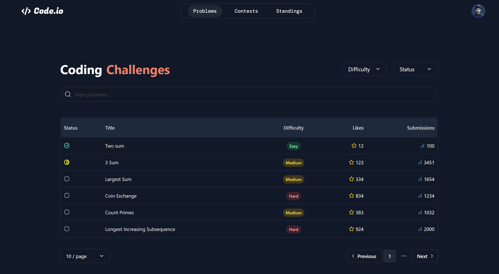
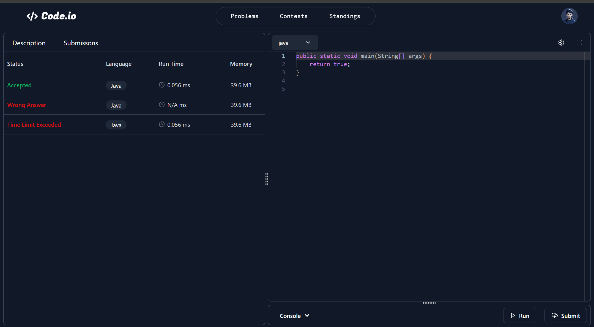

# 🚀 Code.io – Online Code Editor

Code.io is a clean and modern online code editor built for students and developers who want a smooth, distraction-free coding experience directly in their browser. It supports multiple languages, has a beautiful UI, and provides instant output for your code.

> 🧪 Project is currently in development and not yet deployed. Screenshots below demonstrate the UI and functionality.

---

## 🌟 Key Features

- 🔤 **Multi-Language Support** – Write code in various programming languages.
- 🎨 **Beautiful & Responsive UI** – Sleek interface that looks great on all devices.
- 🧠 **Monaco Code Editor** – Smart syntax highlighting.
- ⚡ **Instant Output Console** – Run your code and view results in real time.
- 🌙 **Dark Mode Ready** – Comfortable coding experience, day or night.

---

## 📸 Screenshots

### 🏠 Home Page
A clean and welcoming home screen to start coding with ease.


---
### 🧩 Problem Set
Provides diverse set of coding questions to practice and improve your programming skills.



---
### 👨‍💻 Code Editor
A powerful editor using Monaco, with syntax highlighting and smart suggestions.



---

## 🛠️ Tech Stack

| Layer        | Tools Used                 |
|--------------|----------------------------|
| Frontend     | React.js, Tailwind CSS, Shadcn UI   |
| Code Editor  | Monaco Editor              |
| Future Backend | Node.js, Express.js     |
| Other Tools  | Axios, REST APIs           |

---

## 🧑‍💻 Set up Locally

Follow the steps below to run this project on your local machine:

```bash
# Fork this repository to your own GitHub account.

# Clone the repository
git clone https://github.com/yourusername/code.io.git

# Move into the project directory
cd code.io

# Install the dependencies
npm install

# Start the development server
npm run dev

